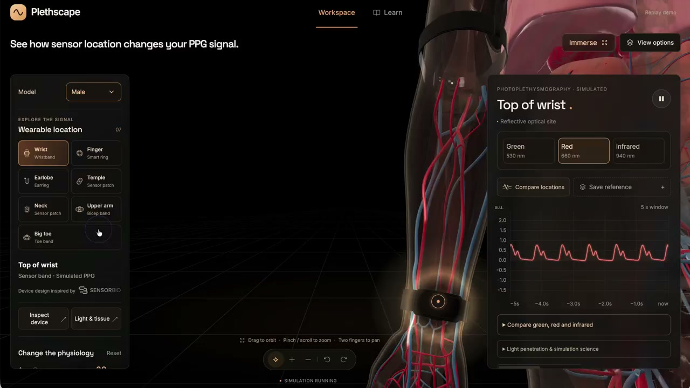

# Plethscape

An interactive 3D physiology lab for exploring where and how photoplethysmography (PPG) sensors read a heartbeat. Pick a sensing site on a detailed anatomical body, change age, activity and breathing, and watch a synthetic PPG waveform respond in real time.

**Live demo:** [chatppg.com/plethscape](https://chatppg.com/plethscape)

## Demo

[](docs/media/plethscape-demo.mp4 "Click to play the demo video (MP4)")

_Click the image to play the demo video. See [docs/media/plethscape-demo.mp4](docs/media/plethscape-demo.mp4)._


## Why I built this

Sameer Sontakey, the author, on the motivation for Plethscape (from his [LinkedIn post](https://www.linkedin.com/posts/sontakey_gpt-6-astra-is-absolutely-insane-i-just-activity-7504175548571635714-iVaQ)):

> I've spent 10+ years working with raw PPG, the light-based signal wearables use to measure heart rate and more. Most people never see the underlying waveform or understand how it changes with sensor placement and physiology.
>
> Which is better? Ring? Wrist? Temple? The answer is always: it depends.
>
> So I built Plethscape, an interactive 3D physiology lab. Pick a sensing site on the body, change the simulated subject's age and heart rate, and watch the simulated waveform respond across different wavelengths.
>
> I wanted people to be able to explore these signals themselves.

Read the full post, including the sourcing behind the physiology model (Pulse Wave Database, Prof. Peter Charlton's multi-site PPG work, BodyParts3D anatomy), on [LinkedIn](https://www.linkedin.com/posts/sontakey_gpt-6-astra-is-absolutely-insane-i-just-activity-7504175548571635714-iVaQ).

## What it is / is not

Plethscape is an **educational simulation**. The anatomy is real (BodyParts3D geometry), but the PPG waveform is generated by an analytical teaching model, not measured from a patient or device. It is **not**:

- a diagnostic tool or clinical simulator
- a calibrated optical or hemodynamic model
- a reproduction of any specific device's proprietary signal-processing algorithm

It's built to make one thing intuitive: how sensor placement, physiology and movement change what a PPG sensor actually sees. See [docs/SCIENCE.md](docs/SCIENCE.md) for the full model, assumptions and limits.

## Quickstart

```sh
nvm use
npm ci
npm run dev
```

Open the local URL Vite prints (normally http://localhost:5173).

## Scripts

| Command               | What it does                                                                    |
| --------------------- | ------------------------------------------------------------------------------- |
| `npm run dev`         | Start the Vite dev server                                                       |
| `npm run build`       | Type-check (`tsc -b`) and produce a production build in `dist/`                 |
| `npm run preview`     | Serve the production build locally                                              |
| `npm test`            | Run signal-model and morphology unit tests                                      |
| `npm run test:e2e`    | Run Playwright browser tests (starts/reuses the dev server)                     |
| `npm run format`      | Prettier over `src`, config and this README                                     |
| `npm run model:build` | Rebuild the anatomy atlas from BodyParts3D source (Python 3 + Blender required) |
| `npm run model:skin`  | Rebuild only the neutral presentation skin                                      |

## Architecture

- `src/App.tsx` — top-level state machine: workspace vs. learn mode, active site, captured comparisons, guided tour.
- `src/AnatomyViewer.tsx` / `src/bodyparts.ts` — the Three.js scene: materials, cutaways, cardiac/breathing animation, camera framing.
- `src/locomotion.ts` / `src/locomotionRig.ts` — authored gait tracks and a 21-joint skinned rig for walk/run poses.
- `src/simulation.ts` — the PPG waveform engine (cardiac cycle, rhythm variants, motion artifacts, wavelength response).
- `src/wearables.ts` — procedural wearable device geometry (ring, band, earring, patch, etc.) and their fitted poses.
- `src/surfaceFit.ts` — conforms devices to the loaded skin surface rather than fixed planes.
- `src/LearnPage.tsx`, `src/GuidedTour.tsx`, `src/SiteChoiceLesson.tsx` — the Learn mode: lesson picker, guided tour, and topic lessons.
- `src/SignalStudio.tsx`, `src/Waveform.tsx`, `src/FiducialGuide.tsx` — the PPG panel: live/replay views, fiducial labeling, multi-site comparison.

To add a new sensing site: extend the site table in `src/bodyparts.ts` and the wearable geometry in `src/wearables.ts`, then add its waveform parameters in `src/simulation.ts`. To add a new waveform parameter (e.g. a new rhythm or motion condition): extend `src/simulation.ts` and expose a control in `src/App.tsx`'s Advanced Settings panel.

## Model pipeline

The viewer uses BodyParts3D 4.0 geometry (body, muscles, skeleton, heart, vascular trees) plus Human Reference Atlas lung geometry, converted into a single Draco-compressed glTF atlas (`public/models/bodyparts-atlas.glb`, ~9.5 MB, 2.08M triangles). Prebuilt models are committed — **you do not need Python or Blender to run or develop the app.**

You only need the model pipeline (`npm run model:build`, requires Python 3 and Blender on `PATH`) if you're changing which anatomical structures are included or how they're classified. See [docs/ANATOMY-SOURCES.md](docs/ANATOMY-SOURCES.md) for exact source coverage and adaptations.

## Testing

- **Unit tests** (`npm test`): signal-model invariants, morphology, gait and rhythm math. Fast, no browser.
- **E2E tests** (`npm run test:e2e`): Playwright, real Chromium, covers discovery flow, anatomy interaction, responsive layout, guided tour, and site comparison. CI runs headless with software rendering (`--use-gl=angle --use-angle=swiftshader`) since GitHub Actions runners have no GPU.
- Run `npm run test:e2e` locally with a real GPU; E2E results are advisory in CI.
- CI (`.github/workflows/ci.yml`) runs both suites plus the production build on every push and PR.

## Contributing

See [CONTRIBUTING.md](CONTRIBUTING.md).

## Attribution

Anatomy models are derived from BodyParts3D and Human Reference Atlas data under CC BY 4.0, not MIT. The Renderpeople-derived presentation heads have separate restricted terms and are not open-source assets. Full attribution, adaptations and terms are in [public/ATTRIBUTION.md](public/ATTRIBUTION.md).

## License

MIT for the application code. See [LICENSE](LICENSE). BodyParts3D and Human Reference Atlas anatomy assets carry separate CC BY 4.0 attribution requirements. Renderpeople-derived presentation heads carry separate restricted terms and are not covered by MIT or CC BY 4.0. The bundled Google Draco decoder is Apache 2.0. Sensor Bio marks and brand assets are excluded from the MIT license. See [public/ATTRIBUTION.md](public/ATTRIBUTION.md).
